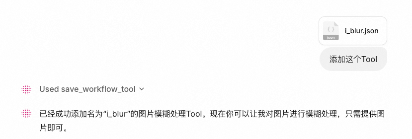

# 🎨 Pixelle MCP

> ✨ 基于 MCP 协议的 AIGC 方案，0代码将 ComfyUI 工作流转化为 Agent 工具，让 LLM 与 ComfyUI 强强联合。

<效果演示 | 待补充>

## 📁 项目结构

- **mcp-client**: 🌐 MCP 客户端，基于 Chainlit 构建的 Web 界面
- **mcp-server**: 🗄️ MCP 服务端，提供各种 AIGC 工具和服务

## 🚀 功能特性

- [x] 🔄 支持TISV（Text、Image、Sound/Speech、Video）全模态的互转和生成
- [x] 🧩 底层基于[ComfyUI](https://github.com/comfyanonymous/ComfyUI)实现，继承ComfyUI的开放生态下的所有能力
- [x] 🔧 制定并实现了 Workflow 即 MCP Tool 的方案，0代码开发，即可动态添加新的 MCP Tool
- [x] 🔌 server端基于[MCP](https://modelcontextprotocol.io/introduction)协议提供功能支持，支持任意mcp client集成（包含但不限于Cursor、Claude Desktop等）
- [x] 💻 client端基于[Chaintlit](https://github.com/Chainlit/chainlit)框架开发，继承了Chainlit的UI交互控件，支持集成更多的MCP Server


## 🏃‍♂️ 快速开始

### 📥 1. 克隆源码 & 更改配置

#### 📦 1.1 克隆源码

```shell
git clone https://github.com/AIDC-AI/Pixelle-MCP.git
cd Pixelle-MCP
```

#### 🗄️ 1.2 更改服务端配置

```shell
cd mcp-server
cp .env.example .env
# 按需更改.env的配置
```

#### 🌐 1.3 更改客户端配置

```shell
cd mcp-client
cp .env.example .env
# 按需更改.env的配置
```

### 🔧 2. 添加MCP Tool（可选）

这一步是可选的，只会决定你Agent的能力，不影响正常对话，如果你暂时不需要，可以先跳过。

`mcp-server/workflows`中是我们默认提供的一套目前比较热门的工作流，运行如下命令可以将其拷贝到你的mcp-server中，服务启动时会自动将其转化为MCP Tool，供大模型调用。

**注：这里强烈建议在拷贝之前，先将工作流拖进你的ComfyUI画布试运行，以确保后续调用过程中能够顺利执行。**

```shell
cp -r mcp-server/workflows mcp-server/data/custom_workflows
```

### 🚀 3. 启动服务

#### 🐳 3.1 Docker方式启动（推荐）

```shell
docker compose --profile all up -d
```

运行完成之后，对应这几个服务都会开启：

- **客户端**: 🌐 http://localhost:9003 (Chainlit Web UI)
- **服务端**: 🗄️ http://localhost:9002/sse (MCP Server)
- **MinIO**: 📦 http://localhost:9001 (对象存储管理界面)

#### 🛠️ 3.2 源码方式启动

a. 📦 自行运行 [minio](https://github.com/minio/minio) 服务，并更改`mcp-client/.env`和`mcp-server/.env`中对应的Minio配置

b. 🐍 安装 [uv](https://github.com/astral-sh/uv) 环境

c. 🗄️ 启动服务端

```shell
# 进入目录
cd mcp-server
# 安装依赖 (仅首次或更新时需要)
uv sync
# 启动服务
uv run main.py
```

d. 🌐 启动客户端

```shell
# 进入目录
cd mcp-client
# 安装依赖 (仅首次或更新时需要)
uv sync
# 启动服务
uv run main.py
```


## 🛠️ 添加自己的MCP Tool

⚡ 一个工作流即为提个MCP Tool

### 🎯 1. 添加最简单的MCP Tool

* 📝 在ComfyUI中搭建一个实现图片高斯模糊的工作流（[点击获取](docs/i_blur_ui.json)），然后将 `LoadImage `节点的 title 改为 `$image.image!`，如下图


* 📤 然后将其导出为api格式文件，并重命名为 `i_blur.json`，你可以自己导出，也可以直接使用我们为你导出好的（[点击获取](docs/i_blur.json)）

* 📋 复制导出的API格式工作流文件（注：务必是API格式的），在web页面输入，并LLM添加这个Tool

  

* ✨ 消息发送后，LLM会让将这个工作流自动转化为一个MCP Tool

  

* 🎨 此时，刷新页面，再发送任意图片，即可实现基于LLM进行的高斯模糊处理

  

### 🔌 2. 添加复杂的MCP Tool

📊 添加MCP Tool的步骤和前面一样，唯一不一样的就是工作流部分（点击下载工作流：[UI格式](docs/t2i_by_flux_turbo_ui.json) 和 [API格式](docs/t2i_by_flux_turbo.json)）


## 🔧 ComfyUI Workflow 自定义规范

### 🎨 工作流格式
系统支持 ComfyUI 的工作流，只需要在画布中设计好工作流，然后导出为 API 格式即可。通过在节点标题中使用特殊语法来定义参数和输出。

### 📝 参数定义规范

在 ComfyUI 画布中，双击节点标题进行编辑，使用以下 DSL 语法定义参数：

```
$<参数名>.<字段名>[!][:<描述信息>]
```

#### 🔍 语法说明：
- `参数名`：生成的MCP工具函数的参数名
- `字段名`：节点中对应的输入字段名
- `!`：表示该参数为必需参数
- `描述信息`：参数的描述

#### 💡 操作示例：

**必需参数示例：**

- LoadImage 节点标题设为：`$image.image!:输入图片URL`
- 含义：创建名为 `image` 的必需参数，对应节点的 `image` 字段

**可选参数示例：**

- `EmptyLatentImage` 节点 title 设为：`$width.width:图片宽度，默认512`
- 含义：创建名为 `width` 的可选参数，对应节点的 `width` 字段，默认值为节点中设置的 512

### 🎯 类型推断规则

系统会根据节点字段的当前值自动推断参数类型：
- 🔢 `int` 类型：整数值（如 512, 1024）
- 📊 `float` 类型：浮点数值（如 1.5, 3.14）
- ✅ `bool` 类型：布尔值（如 true, false）
- 📝 `str` 类型：字符串值（默认类型）

### 📤 输出定义规范

#### 🤖 方式1：自动识别输出节点
系统会自动识别以下常见的输出节点：
- 🖼️ `SaveImage` - 图片保存节点
- 🎬 `SaveVideo` - 视频保存节点
- 🔊 `SaveAudio` - 音频保存节点
- 📹 `VHS_SaveVideo` - VHS视频保存节点
- 🎵 `VHS_SaveAudio` - VHS音频保存节点

#### 🎯 方式2：手动标记输出
> 一般用在包含多个输出的场景
在任意节点的标题中使用 `$output.变量名` 来标记输出：
- 节点标题设为：`$output.result`
- 系统会将此节点的输出作为工具的返回值


### 📄 工具描述配置（可选）

可以在工作流中添加一个标题为 `MCP` 的节点来提供工具描述：

1. 添加一个 `easy string` 或类似的文本节点
2. 将节点标题设为：`MCP`
3. 在节点的值字段中输入工具的详细描述

### 🎨 完整操作示例

以图片模糊处理工具为例：

1. **📥 添加LoadImage节点**
   - 设置默认图片
   - 修改标题为：`$image.image!:需要处理的图片URL`

2. **🌀 添加ImageBlur节点**
   - 连接LoadImage的输出
   - 设置模糊半径为 15
   - 修改标题为：`$blur_radius.blur_radius:模糊半径，值越大越模糊`

3. **💾 添加SaveImage节点**
   - 连接ImageBlur的输出
   - 标题保持 `Save Image`（系统自动识别）

4. **📝 添加描述节点（可选）**
   - 添加 `easy string` 节点
   - 标题设为：`MCP`
   - 值设为：`图片模糊处理工具，可以对输入图片进行高斯模糊处理`

### ⚠️ 重要注意事项

1. **🔒 参数验证**：标记为可选的参数（没有!符号）必须在节点中设置默认值
2. **🔗 节点连接**：已连接到其他节点的字段不会被解析为参数
3. **🏷️ 工具命名**：导出的文件名将作为工具名称，建议使用有意义的英文名称
4. **📋 描述详细**：尽量在参数描述中提供详细说明，提升用户体验
5. **🎯 导出格式**：必须导出为 API 格式，不要导出 UI 格式


## 🤝 如何参与共建

我们欢迎所有形式的贡献！无论您是开发者、设计师还是用户，都可以通过以下方式参与项目建设：

### 🐛 报告问题
* 📋 在 [Issues](https://github.com/AIDC-AI/Pixelle-MCP/issues) 页面提交 Bug 报告
* 🔍 提交前请先搜索是否已有相似问题
* 📝 请详细描述问题的复现步骤和环境信息

### 💡 功能建议
* 🚀 在 [Issues](https://github.com/AIDC-AI/Pixelle-MCP/issues) 中提交功能请求
* 💭 描述您希望添加的功能及其使用场景
* 🎯 解释该功能如何改善用户体验

### 🔧 代码贡献

#### 📋 贡献流程
1. 🍴 Fork 本仓库到您的 GitHub 账户
2. 🌿 创建功能分支：`git checkout -b feature/your-feature-name`
3. 💻 进行开发并添加相应的测试
4. 📝 提交更改：`git commit -m "feat: add your feature"`
5. 📤 推送到您的仓库：`git push origin feature/your-feature-name`
6. 🔄 创建 Pull Request 到主仓库

#### 🎨 代码规范
* 🐍 Python 代码遵循 [PEP 8](https://pep8.org/) 规范
* 📖 为新功能添加适当的文档和注释

### 🧩 贡献工作流
* 📦 分享您的 ComfyUI 工作流到社区
* 🛠️ 提交经过测试的工作流文件
* 📚 为工作流添加使用说明和示例

### 💬 社区交流
* 🎯 参与 [Discussions](https://github.com/AIDC-AI/Pixelle-MCP/discussions) 讨论
* 💡 分享使用经验和最佳实践
* 🤝 帮助其他用户解决问题

### 📋 开发环境
参考【快速开始】部分搭建开发环境，推荐使用源码方式启动进行开发调试。

感谢您对 Pixelle MCP 项目的关注和支持！🙏


## 🙏 致谢

❤️ 衷心感谢以下所有组织、项目和团队，为本项目的发展和落地提供了支持。

* 🧩 [ComfyUI](https://github.com/comfyanonymous/ComfyUI)
* 💬 [Chainlit](https://github.com/Chainlit/chainlit)
* 🗄️ [Minio](https://github.com/minio/minio)
* 🔌 [MCP](https://modelcontextprotocol.io/introduction)
* 🎬 [WanVideo](https://github.com/Wan-Video/Wan2.1)
* ⚡ [Flux](https://github.com/black-forest-labs/flux)