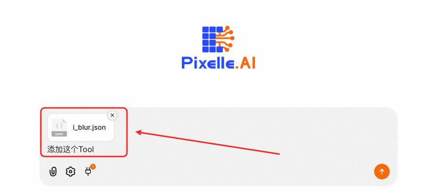
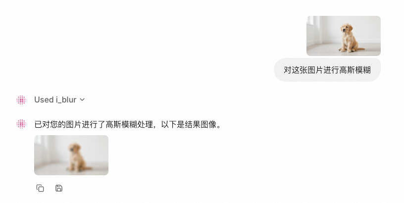

# 🎨 Pixelle MCP

> ✨ 这是一个基于 MCP (Model Context Protocol) 的 AIGC 工具集合项目，致力于打造AI生态的大一统解决方案。

<效果演示 | 待补充>

## 📁 项目结构

- **mcp-client**: 🌐 MCP 客户端，基于 Chainlit 构建的 Web 界面
- **mcp-server**: 🗄️ MCP 服务端，提供各种 AIGC 工具和服务

## 🚀 功能特性

- [x] 🔄 支持TISV（Text、Image、Sound/Speech、Video）全模态的互转和生成
- [x] 🧩 底层基于[ComfyUI](https://github.com/comfyanonymous/ComfyUI)实现，继承ComfyUI的开放生态下的所有能力
- [x] 🔧 制定并实现了 Workflow 即 MCP Tool 的方案，0代码开发，即可动态添加新的 MCP Tool
- [x] 🔌 server端基于[MCP](https://modelcontextprotocol.io/introduction)协议提供功能支持，支持任意mcp client集成（包含但不限于Cursor、Claude Desktop等）
- [x] 💻 client端基于[Chaintlit](https://github.com/Chainlit/chainlit)框架开发，继承了Chainlit的UI交互控件，支持集成更多的MCP Server


## 🏃‍♂️ 快速开始

### 📥 1. 克隆源码 & 更改配置

#### 📦 1.1 克隆源码

```shell
git clone https://github.com/AIDC-AI/Pixelle-MCP.git
cd Pixelle-MCP
```

#### 🗄️ 1.2 更改服务端配置

```shell
cd mcp-server
cp .env.example .env
# 按需更改.env的配置
```

#### 🌐 1.3 更改客户端配置

```shell
cd mcp-client
cp .env.example .env
# 按需更改.env的配置
```

### 🔧 2. 添加MCP Tool（可选）

这一步是可选的，只会决定你Agent的能力，不影响正常对话，如果你暂时不需要，可以先跳过。

`mcp-server/workflows`中是我们默认提供的一套目前比较热门的工作流，运行如下命令可以将其拷贝到你的mcp-server中，服务启动时会自动将其转化为MCP Tool，供大模型调用。

**注：这里强烈建议在拷贝之前，先将工作流拖进你的ComfyUI画布试运行，以防后续调用过程中执行失败。**

```shell
cp -r  mcp-server/workflows mcp-server/data/custom_workflows
```

### 🚀 3. 启动服务

#### 🐳 3.1 Docker方式启动（推荐）

```shell
docker compose --profile all up -d
```

运行完成之后，对应这几个服务都会开启：

- **客户端**: 🌐 http://localhost:9003 (Chainlit Web UI)
- **服务端**: 🗄️ http://localhost:9002/sse (MCP Server)
- **MinIO**: 📦 http://localhost:9001 (对象存储管理界面)

#### 🛠️ 3.2 源码方式启动

a. 📦 自行运行 [minio](https://github.com/minio/minio) 服务，并更改`mcp-client/.env`和`mcp-server/.env`中对应的Minio配置

b. 🐍 安装 [uv](https://github.com/astral-sh/uv) 环境

c. 🗄️ 启动服务端

     ```shell
     # 进入目录
     cd mcp-server
     # 安装依赖 (仅首次或更新时需要)
     uv sync
     # 启动服务
     uv run main.py
     ```

d. 🌐 启动客户端

```shell
# 进入目录
cd mcp-client
# 安装依赖 (仅首次或更新时需要)
uv sync
# 启动服务
uv run main.py
```


## 🛠️ 添加自己的MCP Tool

⚡ 一个工作流即为提个MCP Tool

### 🎯 1. 添加最简单的MCP Tool

* 📝 在ComfyUI中搭建一个实现图片高斯模糊的工作流（[点击获取](docs/i_blur_ui.json)），然后将 `LoadImage `节点的 title 改为 `$image.image!`，如下图


* 📤 然后将其导出为api格式文件，并重命名为 `i_blur.json`，你可以自己导出，也可以直接使用我们为你导出好的（[点击获取](docs/i_blur.json)）

* 📋 复制导出的API格式工作流文件（注：务必是API格式的），在web页面输入，并LLM添加这个Tool

  

* ✨ 消息发送后，LLM会让将这个工作流自动转化为一个MCP Tool

  

* 🎨 此时，刷新页面，再发送任意图片，即可实现基于LLM进行的高斯模糊处理

  

### 🔌 2. 添加复杂的MCP Tool

📊 添加MCP Tool的步骤和前面一样，唯一不一样的就是工作流部分（点击下载工作流：[UI格式](docs/t2i_by_flux_turbo_ui.json) 和 [API格式](docs/t2i_by_flux_turbo.json)）


## 🔧 更多自定义配置

<待补充>


## 🙏 致谢

❤️ 衷心感谢以下所有组织、项目和团队，为本项目的发展和落地提供了支持。

* 🧩 [ComfyUI](https://github.com/comfyanonymous/ComfyUI)
* 💬 [Chainlit](https://github.com/Chainlit/chainlit)
* 🗄️ [Minio](https://github.com/minio/minio)
* 🔌 [MCP](https://modelcontextprotocol.io/introduction)
* 🎬 [WanVideo](https://github.com/Wan-Video/Wan2.1)
* ⚡ [Flux](https://github.com/black-forest-labs/flux)


## 🤝 如何参与共建

<待补充>

