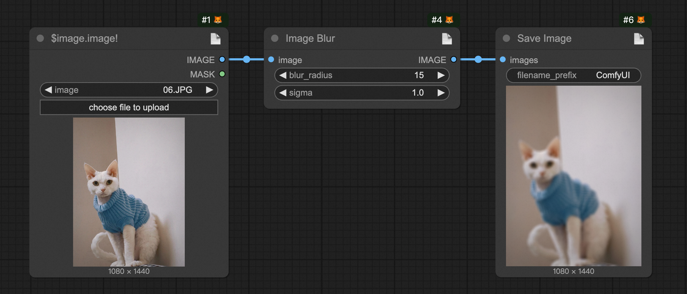
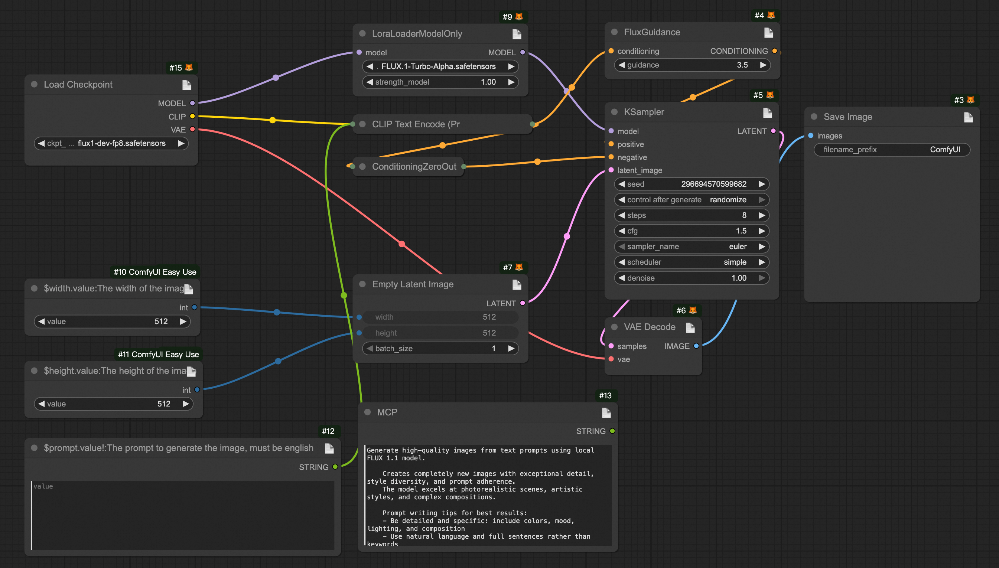

<h1 align="center">🎨 Pixelle MCP</h1>

<p align="center">✨ An AIGC solution based on MCP protocol that seamlessly converts ComfyUI workflows into Agent tools with zero code, combining the power of LLM and ComfyUI.</p>

<p align="center"><a href="README.md">中文</a> | <b>English</b></p>

<Demo | To be added>

## 📁 Project Structure

- **mcp-client**: 🌐 MCP client with Web interface built on Chainlit
- **mcp-server**: 🗄️ MCP server providing various AIGC tools and services

## 🚀 Features

- [x] 🔄 Support full-modal TISV (Text, Image, Sound/Speech, Video) conversion and generation
- [x] 🧩 Built on [ComfyUI](https://github.com/comfyanonymous/ComfyUI), inheriting all capabilities from ComfyUI's open ecosystem
- [x] 🔧 Implemented Workflow-as-MCP-Tool solution with zero-code development for dynamic MCP Tool addition
- [x] 🔌 Server based on [MCP](https://modelcontextprotocol.io/introduction) protocol, supporting integration with any MCP client (including but not limited to Cursor, Claude Desktop, etc.)
- [x] 💻 Client developed with [Chainlit](https://github.com/Chainlit/chainlit) framework, inheriting Chainlit's UI interaction components and supporting integration with more MCP Servers

## 🏃‍♂️ Quick Start

### 📥 1. Clone Repository & Configure Settings

#### 📦 1.1 Clone Repository

```shell
git clone https://github.com/AIDC-AI/Pixelle-MCP.git
cd Pixelle-MCP
```

#### 🗄️ 1.2 Configure Server

```shell
cd mcp-server
cp .env.example .env
# Modify .env configuration as needed
```

#### 🌐 1.3 Configure Client

```shell
cd mcp-client
cp .env.example .env
# Modify .env configuration as needed
```

### 🔧 2. Add MCP Tools (Optional)

This step is optional and only determines your Agent's capabilities without affecting normal conversation. You can skip this if not needed immediately.

The `mcp-server/workflows` directory contains a default set of popular workflows. Run the following command to copy them to your mcp-server, and they will be automatically converted to MCP Tools when the service starts, available for LLM calls.

**Note: We strongly recommend testing workflows in your ComfyUI canvas before copying to ensure smooth execution during subsequent calls.**

```shell
cp -r mcp-server/workflows mcp-server/data/custom_workflows
```

### 🚀 3. Start Services

#### 🐳 3.1 Docker Launch (Recommended)

```shell
docker compose --profile all up -d
```

After completion, the following services will be available:

- **Client**: 🌐 http://localhost:9003 (Chainlit Web UI)
- **Server**: 🗄️ http://localhost:9002/sse (MCP Server)
- **MinIO**: 📦 http://localhost:9001 (Object Storage Management Interface)

#### 🛠️ 3.2 Source Code Launch

a. 📦 Run [minio](https://github.com/minio/minio) service yourself and update the corresponding Minio configuration in `mcp-client/.env` and `mcp-server/.env`

b. 🐍 Install [uv](https://github.com/astral-sh/uv) environment

c. 🗄️ Start Server

```shell
# Enter directory
cd mcp-server
# Install dependencies (only needed for first time or updates)
uv sync
# Start service
uv run main.py
```

d. 🌐 Start Client

```shell
# Enter directory
cd mcp-client
# Install dependencies (only needed for first time or updates)
uv sync
# Start service
uv run main.py
```

## 🛠️ Add Your Own MCP Tools

⚡ One workflow equals one MCP Tool

### 🎯 1. Add the Simplest MCP Tool

* 📝 Build a workflow in ComfyUI that implements image Gaussian blur ([Download workflow](docs/i_blur_ui.json)), then change the title of the `LoadImage` node to `$image.image!`, as shown below


* 📤 Export it as an API format file and rename to `i_blur.json`. You can export it yourself or use our pre-exported version ([Download here](docs/i_blur.json))

* 📋 Copy the exported API format workflow file (Note: must be API format), input it in the web page, and let LLM add this Tool

  

* ✨ After sending the message, LLM will automatically convert this workflow into an MCP Tool

  

* 🎨 Now refresh the page and send any image to perform Gaussian blur processing through LLM

  

### 🔌 2. Add Complex MCP Tools

📊 The process for adding MCP Tools is the same as before, the only difference is the workflow part (Download workflows: [UI format](docs/t2i_by_flux_turbo_ui.json) and [API format](docs/t2i_by_flux_turbo.json))



## 🔧 ComfyUI Workflow Custom Specifications

### 🎨 Workflow Format
The system supports ComfyUI workflows. Simply design your workflow in the canvas and export it as API format. Define parameters and outputs using special syntax in node titles.

### 📝 Parameter Definition Specifications

In ComfyUI canvas, double-click node titles to edit using the following DSL syntax:

```
$<parameter_name>.<field_name>[!][:<description>]
```

#### 🔍 Syntax Explanation:
- `parameter_name`: Parameter name for the generated MCP tool function
- `field_name`: Corresponding input field name in the node
- `!`: Indicates this parameter is required
- `description`: Parameter description

#### 💡 Operation Examples:

**Required Parameter Example:**

- Set LoadImage node title to: `$image.image!:Input image URL`
- Meaning: Creates a required parameter named `image` corresponding to the node's `image` field

**Optional Parameter Example:**

- Set `EmptyLatentImage` node title to: `$width.width:Image width, default 512`
- Meaning: Creates an optional parameter named `width` corresponding to the node's `width` field, with default value of 512 set in the node

### 🎯 Type Inference Rules

The system automatically infers parameter types based on current node field values:
- 🔢 `int` type: Integer values (e.g., 512, 1024)
- 📊 `float` type: Float values (e.g., 1.5, 3.14)
- ✅ `bool` type: Boolean values (e.g., true, false)
- 📝 `str` type: String values (default type)

### 📤 Output Definition Specifications

#### 🤖 Method 1: Automatic Output Node Recognition
The system automatically recognizes the following common output nodes:
- 🖼️ `SaveImage` - Image save node
- 🎬 `SaveVideo` - Video save node
- 🔊 `SaveAudio` - Audio save node
- 📹 `VHS_SaveVideo` - VHS video save node
- 🎵 `VHS_SaveAudio` - VHS audio save node

#### 🎯 Method 2: Manual Output Marking
> Generally used in scenarios with multiple outputs
Use `$output.variable_name` in any node's title to mark output:
- Set node title to: `$output.result`
- The system will use this node's output as the tool's return value

### 📄 Tool Description Configuration (Optional)

You can add a node titled `MCP` in your workflow to provide tool description:

1. Add an `easy string` or similar text node
2. Set node title to: `MCP`
3. Enter detailed tool description in the node's value field

### 🎨 Complete Operation Example

Using image blur processing tool as example:

1. **📥 Add LoadImage Node**
   - Set default image
   - Change title to: `$image.image!:Image URL to be processed`

2. **🌀 Add ImageBlur Node**
   - Connect to LoadImage output
   - Set blur radius to 15
   - Change title to: `$blur_radius.blur_radius:Blur radius, higher values mean more blur`

3. **💾 Add SaveImage Node**
   - Connect to ImageBlur output
   - Keep title as `Save Image` (automatically recognized by system)

4. **📝 Add Description Node (Optional)**
   - Add `easy string` node
   - Set title to: `MCP`
   - Set value to: `Image blur processing tool that applies Gaussian blur to input images`

### ⚠️ Important Notes

1. **🔒 Parameter Validation**: Parameters marked as optional (without ! symbol) must have default values set in the node
2. **🔗 Node Connections**: Fields already connected to other nodes will not be parsed as parameters
3. **🏷️ Tool Naming**: The exported filename will be used as the tool name; meaningful English names are recommended
4. **📋 Detailed Descriptions**: Provide detailed explanations in parameter descriptions to improve user experience
5. **🎯 Export Format**: Must export as API format, not UI format

## 🤝 How to Contribute

We welcome all forms of contributions! Whether you're a developer, designer, or user, you can participate in building the project through the following ways:

### 🐛 Report Issues
* 📋 Submit bug reports on the [Issues](https://github.com/AIDC-AI/Pixelle-MCP/issues) page
* 🔍 Please search for similar issues before submitting
* 📝 Please describe the reproduction steps and environment information in detail

### 💡 Feature Suggestions
* 🚀 Submit feature requests in [Issues](https://github.com/AIDC-AI/Pixelle-MCP/issues)
* 💭 Describe the features you'd like to add and their use cases
* 🎯 Explain how the feature would improve user experience

### 🔧 Code Contributions

#### 📋 Contribution Process
1. 🍴 Fork this repository to your GitHub account
2. 🌿 Create feature branch: `git checkout -b feature/your-feature-name`
3. 💻 Develop and add corresponding tests
4. 📝 Commit changes: `git commit -m "feat: add your feature"`
5. 📤 Push to your repository: `git push origin feature/your-feature-name`
6. 🔄 Create Pull Request to main repository

#### 🎨 Code Standards
* 🐍 Python code follows [PEP 8](https://pep8.org/) specifications
* 📖 Add appropriate documentation and comments for new features

### 🧩 Workflow Contributions
* 📦 Share your ComfyUI workflows with the community
* 🛠️ Submit tested workflow files
* 📚 Add usage instructions and examples for workflows

### 💬 Community Communication
* 🎯 Participate in [Discussions](https://github.com/AIDC-AI/Pixelle-MCP/discussions)
* 💡 Share usage experiences and best practices
* 🤝 Help other users solve problems

### 📋 Development Environment
Refer to the Quick Start section to set up the development environment. We recommend using source code launch for development debugging.

Thank you for your attention and support for the Pixelle MCP project! 🙏

## 🙏 Acknowledgments

❤️ Heartfelt thanks to all the following organizations, projects, and teams for their support in the development and implementation of this project.

* 🧩 [ComfyUI](https://github.com/comfyanonymous/ComfyUI)
* 💬 [Chainlit](https://github.com/Chainlit/chainlit)
* 🗄️ [Minio](https://github.com/minio/minio)
* 🔌 [MCP](https://modelcontextprotocol.io/introduction)
* 🎬 [WanVideo](https://github.com/Wan-Video/Wan2.1)
* ⚡ [Flux](https://github.com/black-forest-labs/flux) 